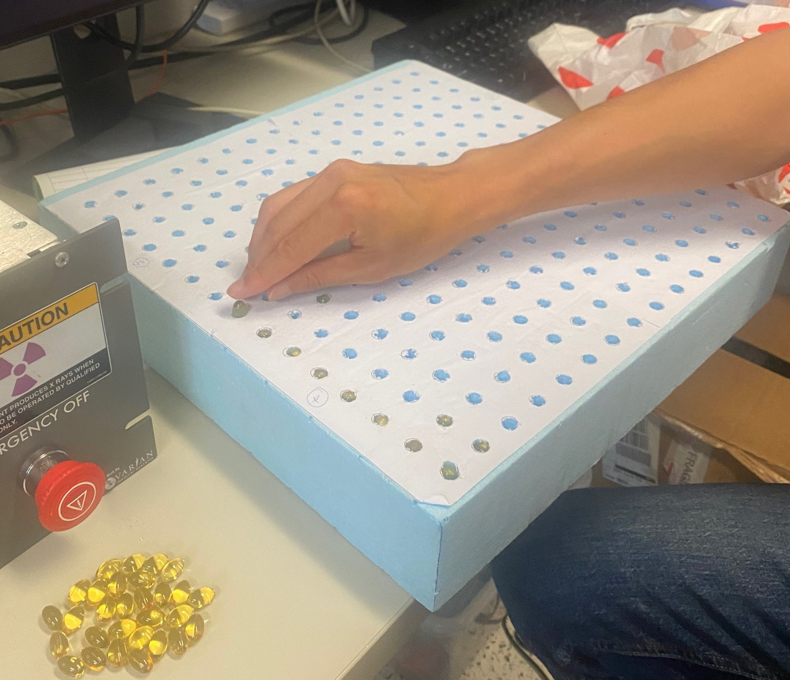

# Phantom Construction

To a first order, the intention of this repository is to enable users to generate a CAD model of a distortion phantom; exactly how to construct it and what to construct it from is somewhat up to the user!

With that said, here are some notes about how we have gone about this previously.

## Specifying geometry for manufacture

When you build your phantom, each "Slice" object has a method called ```add_full_scale_drawing```. This does exactly what it sounds like: adds a 1:1 scale drawing of that slice into the FreeCAD object tree. To add a drawing of a slice, the code looks like the below.

````py
Slice = PhantomBuilder.AddPhantomSlice()
Slice.add_full_scale_drawing()
````

In the FoamPrototypeExample we provide, you would have to add the add_full_scale_drawing() call to eace slice in the for loop.

To export each drawing, simply select it, click file, export, then export as pdf.

From here, you can either print out each pdf if you intend to construct a phantom manually, or send this directly to the manufacturer. In our experience, this pdf drawing along with a phone call were all manufacturers needed.


**Figure: using the full_scale_drawing** adds multiple drawings into the Model tree. Each of these must be manually exported (for now. we will add an auto method in future)


**Figure: we suggest enabling the 'Print Center Marks' option, which doesn't show up in FreeCAD but will print a crosshair in each circle when you export to pdf. This is especially important if you intend to manually drill the holes**

## Markers

The phantom has a number of holes to put markers in, but what should you actually use for markers? We have had a lot of success using fish oil capsules such as [these](https://www.blackmores.com.au/products/fish-oil-1000). Note that the use of oil has ramifications for MRI imaging; we discuss these and provide [suggestions on how to take images safely](https://image-x-institute.github.io/MRI_DistortionPhantom/phantom_imaging.html)

## Background material

The slice could be constructed of anything MRI neutral. We have constructed phantoms from [blue foam](https://dctech.com.au/products/styrofoam-rtm-x/) and [add type of foam](https://www.evolutiongear.com.au/custom-foam-cutting/). If you can find a robust way to manufacture it, foam is an excellent choice as it is super lightweight and storng. However, as described below it can be difficult to manufacture. Alternatively you could use a lightweight plastic but note that even 'light' plastic tends to get quite heavy!

## Joining the slices together

To join the slices together, we used [threaded nylon guide rods](https://www.unitedfasteners.com.au/products/fasteners-fixings/nylon/threaded-rod/nylon-threaded-rod), [washers](https://www.unitedfasteners.com.au/products/fasteners-fixings/nylon/washers/nylon-flat-round-standard-washer) and [nuts](https://www.unitedfasteners.com.au/products/fasteners-fixings/nylon/nuts/nylon-wing-nut). One could also imagine for instance a specialized 'slice holder' like a box that all the slices could slot into, but we did not explore this. 

## Before your first prototype: general tips

- Getting the holes the right size for the markers can involve some trial and error. It's a good idea to build a few single slice prototypes before continuing to a full design. 

## First prototype: Drill press

For our first phantom, we used a drill press on  [blue foam](https://dctech.com.au/products/styrofoam-rtm-x/). An image of this is below. This was quite sucessful, but rather painful to construct a phantom with many holes drilled. There are also obvious limitations to the accuracy of hole placement. We also found that unless you have a high quality drill press, the foam is quite prone to crumbling. 



**Figure: Action shot of our first slice prototype in action!**


**Figure: all slices from a drill press based phantom**

## Second protoype: Laser cut foam

The drill press version was excellent for development, but long term we wanted something more accurate and less labor intensive. For our second prototype, we utilized laser cut foam. There are many vendors capable of this manufacturing technique; we worked with [evolution gear](https://www.evolutiongear.com.au/custom-foam-cutting/). 


**Figure: slice from a laser cut foam provider**